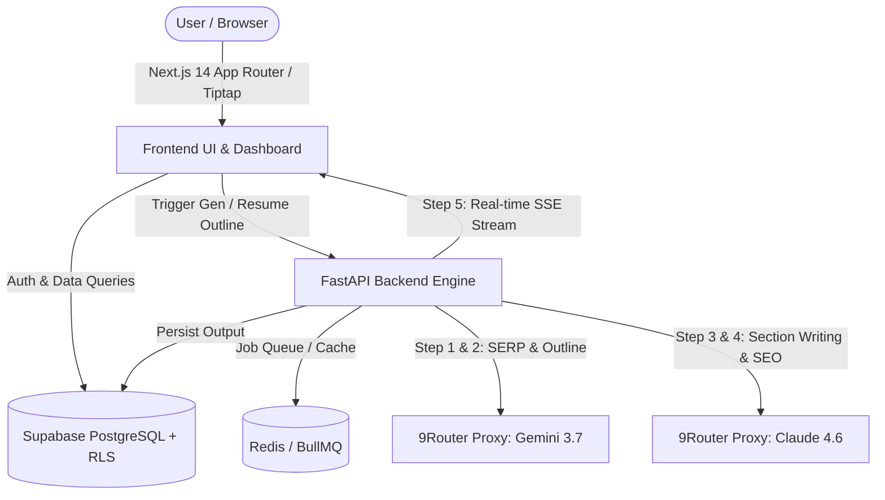

# ⚡ Hariyuka AI — Next-Generation AI SEO Writer Platform

[](https://hariyuka.ai)
[](https://nextjs.org/)
[](https://fastapi.tiangolo.com/)
[](https://supabase.com/)
[](https://tiptap.dev/)

> **Hariyuka AI** adalah platform SaaS pembuat artikel SEO human-grade berbasis **Multi-Step Agentic Pipeline** yang dirancang untuk mengungguli kompetitor dan mendominasi peringkat 1 Google. Menggabungkan analisis SERP otomatis, review outline interaktif, penulisan multi-pass bertenaga Claude 4.6 & Gemini 3.7 via **9Router Proxy**, serta real-time streaming ke Tiptap Rich Editor.

---

## 🌟 Fitur Utama

- 🔍 **Step 1: SERP Scraping & Intent Analysis (Gemini 3.7)**
  Menganalisis kompetitor halaman 1 Google, search intent pembaca, keyword LSI sekunder, entitas semantik, dan *People Also Ask* (PAA).
- 📑 **Step 2: Interactive Outline Review (Gemini 3.7)**
  Menyusun struktur H2/H3 berbobot kata dalam format JSON. Pipeline **dijeda (pause)** untuk memberi kebebasan pengguna mengedit, mengubah urutan (reorder), menambah sub-heading, atau menyesuaikan target kata.
- ✍️ **Step 3: Multi-Pass Section Writer (Claude 4.6)**
  Menulis artikel bagian per bagian dengan *Prompt Chaining*. Mempertahankan konteks bagian sebelumnya untuk mencegah repetisi dan menghasilkan prosa setara jurnalis tanpa klise AI.
- 🎯 **Step 4: SEO & E-E-A-T Refinement (Claude 4.6)**
  Penataan bolding penekanan, optimasi paragraf pendek (punchy), placeholder media `[IMAGE: ...]`, dan penguatan sinyal otoritas E-E-A-T.
- ⚡ **Step 5: Live SSE Streaming & Real-Time Tiptap Editor**
  Output artikel dialirkan secara live (*Server-Sent Events*) ke Tiptap Rich-Text Editor lengkap dengan audit skor SEO (0-100), kepadatan keyword, dan ekspor Markdown / HTML.

---

## 🏗️ Tech Stack & Arsitektur



| Komponen | Teknologi |
| :--- | :--- |
| **Frontend Framework** | Next.js 14+ (App Router), TypeScript, React 18 |
| **Styling & UI** | Tailwind CSS, Lucide Icons, Shadcn UI Themes |
| **Editor Suite** | Tiptap Rich Text Editor (Markdown sync, HTML export, Image embed) |
| **Backend Engine** | Python FastAPI, Pydantic v2, AsyncIO, SSE Streaming |
| **AI Gateway** | 9Router Proxy (`http://202.10.47.200:20128/v1`) via OpenAI SDK |
| **AI Model Routing** | `gemini-3.7` (SERP/Outline) & `claude-4.6` (Writing/Polish) |
| **Database & Auth** | Supabase (PostgreSQL 15+ dengan Row Level Security) |
| **Queue & Cache** | Redis 7 (Alpine) |

---

## 📂 Struktur Direktori

```
HariyukaAI/
├── .env.example                               # Template konfigurasi environment
├── docker-compose.yml                         # Orkestrasi Redis, Backend & Frontend
├── supabase/
│   └── migrations/
│       └── 20260821000001_initial_schema.sql  # Schema SQL PostgreSQL + RLS + Triggers
│
├── backend/                                   # Engine API FastAPI
│   ├── Dockerfile
│   ├── requirements.txt
│   ├── test_pipeline.py                       # Smoke test suite
│   └── app/
│       ├── main.py                            # Entrypoint FastAPI & CORS
│       ├── config.py                          # Pydantic Settings
│       ├── api/v1/
│       │   ├── articles.py                    # REST CRUD & Generation Triggers
│       │   ├── stream.py                      # Server-Sent Events (SSE) Stream
│       │   └── projects.py                    # Brand Voice & Project Settings
│       ├── pipeline/
│       │   └── orchestrator.py                # 5-Step Agentic Pipeline Orchestrator
│       └── services/
│           ├── ai_router.py                   # 9Router OpenAI SDK Client (Gemini & Claude)
│           ├── serp_scraper.py                # SERP Competitor Scraper
│           └── seo_analyzer.py                # Live SEO Scorer & E-E-A-T Audit
│
└── frontend/                                  # Next.js 14 App Router
    ├── package.json
    ├── tailwind.config.ts
    └── src/
        ├── app/
        │   ├── layout.tsx
        │   ├── page.tsx
        │   └── (dashboard)/
        │       ├── dashboard/page.tsx         # Analytics overview
        │       ├── generator/                 # 3-Step Generator Flow
        │       │   ├── _components/step-input.tsx
        │       │   ├── _components/step-outline.tsx
        │       │   └── _components/step-generation.tsx
        │       ├── articles/                  # Manajemen Artikel & Tiptap Editor
        │       │   ├── page.tsx
        │       │   └── [id]/page.tsx
        │       ├── projects/page.tsx          # Brand Voice Manager
        │       ├── billing/page.tsx           # Billing & Kredit
        │       └── settings/page.tsx          # 9Router Gateway Tester
        ├── components/
        │   ├── editor/
        │   │   ├── tiptap-editor.tsx          # Tiptap Rich-Text Suite
        │   │   └── seo-sidebar.tsx            # Live SEO Audit (0-100)
        │   └── layout/
        │       ├── sidebar.tsx
        │       └── header.tsx
        └── lib/
            └── ai-router.ts                   # TypeScript 9Router Client
```

---

## 🚀 Panduan Memulai Cepat (Quickstart)

### 1. Kloning Repositori & Setup Environment
```bash
git clone https://github.com/keefalegends/HariyukaAI.git
cd HariyukaAI
cp .env.example .env
```

Sesuaikan variabel di file `.env`:
```env
# 9Router Proxy AI Configuration
NINEROUTER_BASE_URL=http://202.10.47.200:20128/v1
NINEROUTER_API_KEY=your_api_key_here

# Model Routing Aliases
MODEL_SERP_EXTRACTOR=gemini-3.7
MODEL_OUTLINE_GENERATOR=gemini-3.7
MODEL_SECTION_WRITER=claude-4.6
MODEL_SEO_POLISHER=claude-4.6

# Supabase (Opsional jika menggunakan backend standalone)
NEXT_PUBLIC_SUPABASE_URL=https://your-project.supabase.co
NEXT_PUBLIC_SUPABASE_ANON_KEY=your_anon_key
SUPABASE_SERVICE_ROLE_KEY=your_service_role_key

# Redis
REDIS_URL=redis://localhost:6379/0
```

---

### 2. Menjalankan Backend Engine (FastAPI)
```bash
cd backend
pip install -r requirements.txt
python -m uvicorn app.main:app --reload --port 8000
```
- API Docs & Swagger UI: `http://localhost:8000/docs`
- Health Check: `http://localhost:8000/health`

---

### 3. Menjalankan Frontend Web (Next.js 14)
```bash
cd frontend
npm install
npm run dev
```
Buka browser Anda di `http://localhost:3000`.

---

### 4. Menjalankan via Docker Compose
Jalankan seluruh ekosistem (Redis, FastAPI, Next.js) secara otomatis:
```bash
docker-compose up -d --build
```

---

## 🗄️ Supabase PostgreSQL Migration

Untuk menerapkan schema database, jalankan SQL query dari:
[`supabase/migrations/20260821000001_initial_schema.sql`](supabase/migrations/20260821000001_initial_schema.sql) pada Supabase SQL Editor Anda.

Skrip ini akan membuat:
- ✅ Enum types: `plan_tier_type`, `article_status_type`, `job_status_type`
- ✅ Tabel: `users`, `projects`, `articles`, `generation_jobs`
- ✅ Trigger otomatis `updated_at` & auto sync profil `auth.users` ke `public.users`
- ✅ Kebijakan **Row Level Security (RLS)** untuk proteksi data per-user

---

## 🤝 Kontribusi & Lisensi

Platform ini dikembangkan secara eksklusif untuk **Hariyuka AI**.
Dibuat dengan ❤️ oleh Tim Full-Stack AI Engineer & SaaS Software Architect.
