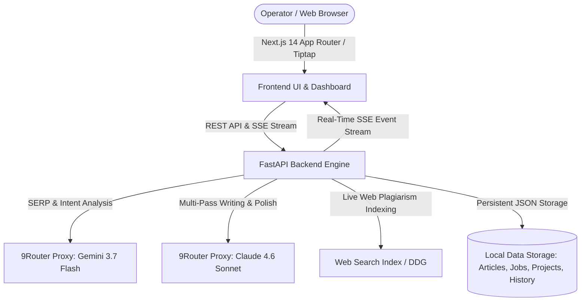

# ⚡ Hariyuka AI — Next-Generation Multi-Agent AI SEO Platform

[](https://nextjs.org/)
[](https://fastapi.tiangolo.com/)
[-emerald?style=for-the-badge)](https://zerogpt.com)
[](https://yoast.com/)
[](https://tiptap.dev/)

> **Hariyuka AI** adalah platform **100% Free & Open-Source Self-Hosted** AI SEO Article Writer & Content Authenticity Suite berbasis **Multi-Step Agentic Pipeline**. Dirancang khusus untuk menghasilkan artikel berbobot jurnalis, lolos sensor detektor AI (*0% AI on ZeroGPT*), mematuhi Standar Operasional Prosedur (SOP) Yoast WordPress, dan siap mendominasi peringkat 1 Google tanpa batasan kredit kata.

---

## 🌟 Fitur Unggulan

### 1. 🤖 5-Step Multi-Agent Generation Pipeline
* 🔍 **Step 1: Analisis SERP & Search Intent (Gemini 3.7)**
  Memindai kompetitor peringkat 1-3 Google, mengidentifikasi search intent, keyword LSI sekunder, entitas semantik, dan *People Also Ask* (PAA).
* 📑 **Step 2: Interactive Outline Review (Gemini 3.7)**
  Menyusun struktur H2/H3 berbobot kata dalam format JSON. Pipeline **dijeda (pause)** untuk memberi kebebasan pengguna mengedit, mengubah urutan (reorder), menambah sub-heading, atau menyesuaikan target kata.
* ✍️ **Step 3: Multi-Pass Section Writer (Claude 4.6)**
  Menulis artikel bagian per bagian dengan *Prompt Chaining*. Mempertahankan konteks bagian sebelumnya untuk mencegah repetisi dan menghasilkan prosa setara jurnalis tanpa klise AI.
* 🎯 **Step 4: Audit Yoast WordPress & Anti-AI Polish (Claude 4.6)**
  Penataan bolding penekanan, eliminasi frasa baku AI, kalibrasi kepadatan kata kunci, dan penyesuaian panjang kata yang presisi.
* ⚡ **Step 5: Live SSE Streaming & Real-Time Tiptap Editor**
  Output artikel dialirkan secara live (*Server-Sent Events*) ke Tiptap Rich-Text Editor lengkap dengan audit skor SEO 100 poin dan ekspor Markdown / HTML.

---

### 2. 📝 Kepatuhan Penuh SOP Yoast WordPress
* **Preset Tipe Artikel Presisi:**
  - 📰 **Artikel Utama (Pillar):** 1.500 – 1.599 kata (komprehensif, multi-heading).
  - 🔗 **Backlink Artikel:** 500 – 599 kata (fokus keyphrase pendukung).
  - 🛍️ **Backlink Produk:** 500 – 599 kata (fokus keyphrase + soft-selling produk/brand).
* **Hierarki Heading Ketat:** Hanya menggunakan H2 (`##`) dan H3 (`###`) di dalam body. Bebas dari tag H1 ganda.
* **Kontrol Kepadatan Keyphrase:** Tersebar seimbang **5 hingga 7 kali** (~1.0% – 1.4%) di seluruh artikel (paragraf pembuka, 2-3 subheadings, dan kesimpulan) untuk mencegah *keyword stuffing*.
* **Injeksi Link Kontekstual & Brand:** Mendukung pengaturan Link 1 (kontekstual artikel) dan Link 2 (homepage brand/produk).
* **Mode Teks Murni:** Secara default menghasilkan markdown bersih tanpa tag `[caption]` bawaan, memberi kebebasan operator untuk menyisipkan media langsung di CMS.

---

### 3. 🛡️ Humanize Writing & Anti-AI Detector Bypass (0% AI on ZeroGPT)
* **Sentence Burstiness Engineering:** Mengombinasikan kalimat sangat pendek (3–6 kata) dengan kalimat panjang deskriptif untuk mengacak ritme sintaksis.
* **Blacklist 100% Frasa Klise Robotik AI:** Menghapus pola kaku seperti *"Ini bukan sekadar X, ini soal Y..."*, *"Hal yang perlu dipahami sejak awal..."*, *"Merupakan langkah krusial..."*, dan *"Tidak dapat dipungkiri bahwa..."*.
* **Partikel Penutur Asli Indonesia:** Menyisipkan partikel penegas alami (*sih*, *kan*, *dong*, *nih*, *lho*, *kok*) dengan gaya bertutur praktisi lapangan yang luwes.
* **Eliminasi Tanda Em-Dash (`—`):** Menghapus tanda pisah khas AI yang sering memicu alarm detektor.

---

### 4. 🔍 Cek Orisinalitas & Plagiarisme (BETA)
* **Pendeteksi Plagiarisme Live Web Indexing:** Memecah teks menjadi N-Gram unik dan mencocokkan secara live ke indeks pencarian web untuk menampilkan persentase keunikan serta daftar URL sumber duplikasi asli jika ada.
* **Pendeteksi Konten AI (Multi-Signal):** Menganalisis *Perplexity Distribution*, *Sentence Burstiness Variance*, dan pola sintaksis untuk menghasilkan breakdown probabilitas AI kalimat per kalimat.
* **Halaman Mandiri (`/checker`):** Area textarea luas untuk memeriksa teks bebas dari mana saja.
* **Integrasi Editor Suite:** Tombol **`Cek AI & Plagiat`** instan di header editor artikel (`/articles/[id]`).
* **Riwayat Audit Tersimpan:** Database lokal disk (`checker_history_db.json`) untuk memuat kembali hasil audit sebelumnya kapan saja.

---

### 5. 💻 Live Background Terminal Console di Sidebar
* Menampilkan log aktivitas real-time: inisialisasi daemon, status koneksi 9Router gateway, proses SERP Gemini 3.7, multi-pass Claude 4.6, dan kalkulasi audit Yoast.
* Opsi Buka/Tutup (*Collapsible*) dengan indikator status dot berdenyut (*pulsing dot*).

---

## 🏗️ Arsitektur & Teknologi



| Komponen | Teknologi |
| :--- | :--- |
| **Frontend Framework** | Next.js 14+ (App Router), TypeScript, React 18, Tailwind CSS |
| **Rich Text Editor** | Tiptap Rich Editor (Markdown & HTML Live Synchronization) |
| **Backend Engine** | Python FastAPI, Pydantic v2, AsyncIO, SSE Streaming |
| **AI Gateway** | 9Router Proxy (OpenAI Compatible) via Async OpenAI SDK |
| **AI Model Routing** | `ag/gemini-3.7-flash-high` (SERP/Outline) & `ag/claude-sonnet-4-6` (Writer/SEO) |
| **Database & Persistence** | Persistent Local JSON Database (`backend/data/`) |

---

## 📂 Struktur Direktori

```
HariyukaAI/
├── .env.example                               # Template konfigurasi environment
├── backend/                                   # Engine API FastAPI
│   ├── app/
│   │   ├── main.py                            # Entrypoint FastAPI & Router Hub
│   │   ├── config.py                          # Pydantic Settings
│   │   ├── api/v1/
│   │   │   ├── articles.py                    # REST CRUD & Pipeline Trigger
│   │   │   ├── checker.py                     # API Cek Plagiarisme & AI Detektor
│   │   │   ├── stream.py                      # Server-Sent Events (SSE) Stream
│   │   │   ├── projects.py                    # Proyek & Brand Voice
│   │   │   └── settings.py                    # Gateway & Model Configuration
│   │   ├── db/
│   │   │   └── storage.py                     # Persistent Local JSON Database Handler
│   │   ├── pipeline/
│   │   │   └── orchestrator.py                # 5-Step Agentic Pipeline Orchestrator
│   │   └── services/
│   │       ├── ai_router.py                   # 9Router Client (Gemini 3.7 & Claude 4.6)
│   │       ├── authenticity_checker.py        # Plagiarism & AI Detection Engine
│   │       ├── serp_scraper.py                # SERP Competitor Scraper
│   │       └── seo_analyzer.py                # Yoast 12-Rules Scoring Engine
│   └── data/                                  # Database Disk (.json)
│
└── frontend/                                  # Next.js 14 App Router
    └── src/
        ├── app/
        │   ├── (dashboard)/
        │   │   ├── dashboard/page.tsx         # Ringkasan analitik & metrik artikel
        │   │   ├── generator/                 # 3-Step Generator Flow
        │   │   ├── articles/                  # Manajemen Artikel & Tiptap Editor Suite
        │   │   ├── checker/page.tsx           # Halaman Cek AI & Plagiat (BETA)
        │   │   ├── projects/page.tsx          # Manajemen Proyek
        │   │   └── settings/page.tsx          # Pengaturan 9Router Gateway
        │   └── login/page.tsx                 # Operator Authentication
        ├── components/
        │   ├── editor/                        # Tiptap Editor & SEO Sidebar
        │   └── layout/                        # Sidebar, Header & Live Terminal
        └── lib/
            └── terminal-bus.ts                # Real-Time Event Bus Terminal
```

---

## 🚀 Panduan Memulai Cepat (Quickstart)

### 1. Kloning Repositori & Setup Environment
```bash
git clone https://github.com/keefalegends/HariyukaAI.git
cd HariyukaAI
cp .env.example .env
```

Sesuaikan konfigurasi gateway 9Router pada file `.env`:
```env
# 9Router Proxy AI Configuration
NINEROUTER_BASE_URL=http://your-9router-host:20128/v1
NINEROUTER_API_KEY=your_9router_api_key_here

# Model Routing Aliases
MODEL_SERP_EXTRACTOR=ag/gemini-3.7-flash-high
MODEL_OUTLINE_GENERATOR=ag/gemini-3.7-flash-high
MODEL_SECTION_WRITER=ag/claude-sonnet-4-6
MODEL_SEO_POLISHER=ag/claude-sonnet-4-6
```

### 2. Jalankan Backend (FastAPI)
```bash
cd backend
python -m venv venv
venv\Scripts\activate          # Windows
# source venv/bin/activate     # Linux/macOS
pip install -r requirements.txt
uvicorn app.main:app --reload --port 8000
```

### 3. Jalankan Frontend (Next.js)
```bash
cd frontend
npm install
npm run dev
```

Buka browser di: **`http://localhost:3000`**

---

## 👥 Tim & Kontributor

* **Keefa (`keefa9`)** — Developer & Architect
* **Salna (`salna9`)** — Content Strategist, QA & Yoast SEO Specialist

---

## 📄 Lisensi
Didistribusikan di bawah lisensi **MIT**. 100% Free & Open-Source.
